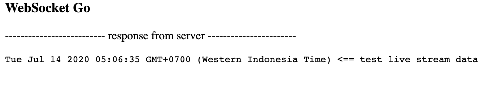

# Messaging API

## Description
This is an example of implementation of GraphQL-Gin-Websocket
This project has  2 Domain layer :
 * Usecase Layer  
 * Delivery Layer

#### The diagram:


### How To Run This Project
Since the project already use glide, I recommend to install glide.
[`How to install glide`](https://glide.sh/)

### Directory structure

```
  + $GOPATH/
  |
  +--+ src/
  |  |
  |  +--+ github.com/
  |     |
  |     |
  |     +--+ graphql-gin-websocket-example/
  |        |
  |        +--+ main.go
  |           + graph/            --Directory related to graphql
  |           + mqtt/             --Mqtt configuration
  |           + screenshot/       --Screenshot for readme
  |           + server/           --Gin-gonic server configuration
  |           + views/            --html directory for ui
  |           + ... any other source code
  |
  +--+ bin/
  |  |
  |  +-- ... executable file
  |
  +--+ pkg/
     |
     +-- ... all dependency_library required

```

#### Run the Applications
Here is the steps to run the application

```bash
# move to directory
$ cd $GOPATH/src

# create github.com directory if not exist
mkdir github.com

# move to github directory
cd github.com

# clone into YOUR $GOPATH/src
$ git clone https://github.com/kpradipta/graphql-gin-websocket-example.git

# move to project
$ cd graphql-gin-websocket-example

# install dependecies using glide
glide install

# build binary file
$ go build

# run binary file
$ go run graphql-gin-websocket-example -c server/config.yaml

# execute the call 
$ curl localhost:9911/ping

if server return pong then your api is ready to serve
```

### How To Test API
```
# execute call to test send message api
$ curl --location --request POST 'localhost:9911/query' \
  --header 'Content-Type: application/json' \
  --data-raw '{"query":"mutation {\n    SendMessage(text: \"ya ?\") {\n        text\n        status\n    }\n}","variables":{}}'

# execute call to test list message api
$ curl --location --request POST 'localhost:9911/query' \
    --header 'Content-Type: application/json' \
    --data-raw '{"query":"{\n    list_message {\n        text\n        status\n    }\n}","variables":{}}'

```

or 

```
# Open localhost:9911/playground
```
### How To Test RealTime API

```
# Open localhost:9911/socket on your favourite browser****

# execute call to test send message api
$ curl --location --request POST 'localhost:9911/query' \
    --header 'Content-Type: application/json' \
    --data-raw '{"query":"mutation {\n    SendMessage(text: \"ya ?\") {\n        text\n        status\n    }\n}","variables":{}}'

# and back to website to check real time message from api
```


### Tools Used:
In this project, I use some tools listed below. But you can use any simmilar library that have the same purposes. But, well, different library will have different implementation type. Just be creative and use anything that you really need. 

- All libraries listed in `glide.yml`

#### Note
- This api by default running on port 9911, if you want to change port go to server/config.yaml, update views/socket.html line 17, update views/index.html line 536
- [`Postman Collection`](https://documenter.getpostman.com/view/485855/T17NbkDL?version=latest)